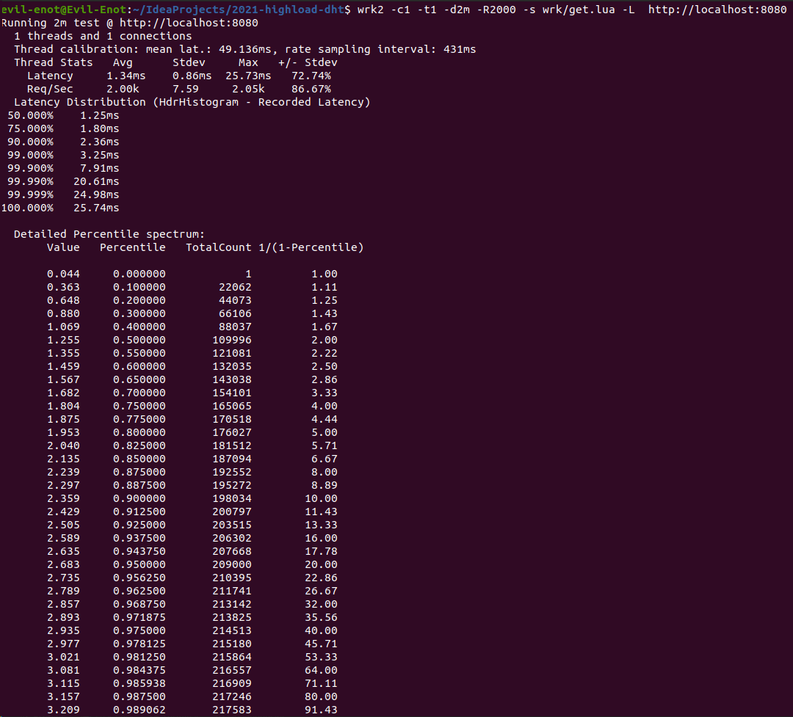
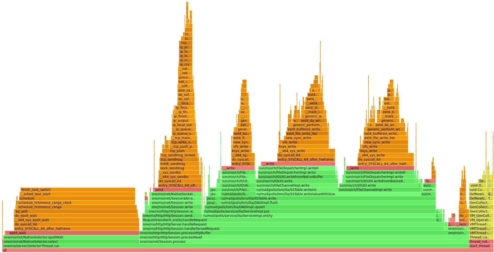

# Отчет по первой работе

## Автор: Солянкин Илья

## Часть 1: Нагрузочное тестирование запросов с использованием [wrk2](https://github.com/giltene/wrk2)

### Wrk2 скрипт для PUT-запросов:

```
counter = 0

request = function()
   path = "/v0/entity?id=key" .. counter
   wrk.method = "PUT"
   wrk.body = "value" .. counter
   counter = counter + 1
   return wrk.format(nil, path)
end
```

Запустим тестирование, задав одно соединение, один поток, 20000 запросов/секунду и продолжительность в 1 минуту:

```
wrk2 -c1 -t1 -d1m -R20000 -L -s wrk/put.lua http://localhost:8080/
```

В итоге получим следующие результаты:


Как можно увидеть, среднее выполнение запросов равно 13.34 сек, максимальное 27.2 сек, в секунду передавалось ~10906
запросов, а общее количество запросов и количество переданной информации было равно 654427 и 49.30МБ соответственно.

Проанализировав результаты можно заметить, что 90 и более процентов запросов обрабатывается с задержкой более чем в
25.48 сек

### Wrk2 скрипт для GET-запросов:

```
counter = 0

request = function()
   path = "/v0/entity?id=key" .. counter
   wrk.method = "GET"
   counter = counter + 1
   return wrk.format(nil, path)
end
```

Запустим тестирование с теми же значениями, что и для PUT-запросов:

```
wrk2 -c1 -t1 -d1m -R20000 -L -s wrk/get.lua http://localhost:8080/
```

В итоге получим следующие результаты:




Как можно увидеть, среднее выполнение запросов равно 16.96 сек, максимальное 30.24 сек, в секунду передавалось ~9916
запросов, а общее количество запросов и количество переданной информации было равно 594980 и 41.87МБ соответственно.

Проанализировав результаты можно заметить, что 90% запросов выполняются с задержкой в 25.9 сек, а 99% и более
обрабатывается с задержкой более чем за 29.84 сек

## Часть 2: Профилирование запросов с использованием [async-profiler](https://github.com/jvm-profiling-tools/async-profiler)

### Профилирование для PUT-запросов:

Для начала профилируем CPU для PUT-запросов. Для этого воспользуемся следующей командой:
```
./profiler.sh -d 20 -f cpu_put.html 33769
```
Т.е. мы запускаем профилировку длительностью 20 секунд и результаты просим сохранить в файл cpu_put.html.



Как можно увидеть, 40.78% занимает NativeSelector и его метод select().
Кроме этого 50.24% занимает обработка Http запроса (HttpServer.handleRequest).


### Профилирование для GET-запросов:

Для начала профилируем CPU для GET-запросов. Для этого воспользуемся следующей командой:
```
./profiler.sh -d 20 -f cpu_put.html 33769
```
Т.е. мы запускаем профилировку длительностью 20 секунд и результаты просим сохранить в файл cpu_put.html. 


Как можно увидеть, 40.78% занимает NativeSelector и его метод select().
Кроме этого 50.24% занимает обработка Http запроса (HttpServer.handleRequest).

 
