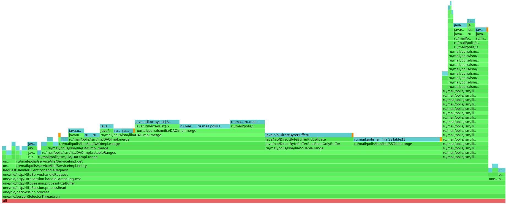

# Отчет по первой работе

## Автор: Солянкин Илья

## Часть 1: Нагрузочное тестирование запросов с использованием [wrk2](https://github.com/giltene/wrk2)

### Wrk2 скрипт для PUT-запросов:

```
counter = 0

request = function()
   path = "/v0/entity?id=key" .. counter
   wrk.method = "PUT"
   wrk.body = "value" .. counter
   counter = counter + 1
   return wrk.format(nil, path)
end
```

Запустим тестирование, задав одно соединение, один поток, 2000 запросов/секунду и продолжительность в 2 минуты:

```
wrk2 -c1 -t1 -d2m -R2000 -L -s wrk/put.lua http://localhost:8080/
```

В итоге получим следующие результаты:


Как можно увидеть, среднее выполнение запросов равно 22.86 ms, максимальное 2.06 сек, в секунду передавалось ~2000
запросов, а общее количество запросов и количество переданной информации было равно 239996 и 18.08МБ соответственно.

Проанализировав результаты можно заметить, что 99% запросов обрабатывается с задержкой в 1.05 сек, т.е. появляетмся
большой скачое в задержке передачи запросов, т.к. 90% обрабатывается всего за 2.68ms. На 99.9 задержка равна уже почти
2-м секундам

### Wrk2 скрипт для GET-запросов:

```
counter = 0

request = function()
   path = "/v0/entity?id=key" .. counter
   wrk.method = "GET"
   counter = counter + 1
   return wrk.format(nil, path)
end
```

Запустим тестирование с теми же значениями, что и для PUT-запросов:

```
wrk2 -c1 -t1 -d2m -R2000 -L -s wrk/get.lua http://localhost:8080/
```

В итоге получим следующие результаты:


Как можно увидеть, среднее выполнение запросов равно 1.34ms, максимальное 25.73ms, в секунду передавалось ~2k запросов,
а общее количество запросов и количество переданной информации было равно 239995 и 16.82МБ соответственно.

Проанализировав результаты можно заметить, что 99.9% запросов выполняются с задержкой в 7.91 ms, а уже 99.99% и более
обрабатывается с задержкой более чем в 20,64 ms, т.е. возникает резкий рост задержки.

## Часть 2: Профилирование запросов с использованием [async-profiler](https://github.com/jvm-profiling-tools/async-profiler)

### Профилирование для PUT-запросов:

#### CPU

Для начала профилируем CPU для PUT-запросов. Для этого воспользуемся следующей командой:

```
./profiler.sh -d 20 -f cpu_put.html 33769
```

Т.е. мы запускаем профилировку длительностью 20 секунд и результаты просим сохранить в файл cpu_put.html.


Как можно увидеть, 27.68% занимает NativeSelector и его метод select(). Кроме этого 61.08% занимает обработка Http
запроса (HttpServer.handleRequest). При этом 12.07% уходит на отправку ответов (HttpSession.SendResponse), а 43.91%
уходит на запись (DAOImpl.flush). Таким образом, проанализировав результаты нагрузочного тестирования и профилирования,
можно сделать вывод, что просадка по обработке запросов связана с методом flush, когда мы записываем данные на диск. Для
оптимизации можно обратить внимание на данный метод. Помимо этого 5% уходит на работу сборщика мусора, что является не
такой критичной проблемой, но которую стоит изучить и изменить код, который генерирует мусор.

#### MEM

Теперь профилируем MEM для PUT-запросов. Для этого воспользуемся следующей командой:

```
/profiler.sh -d 20 -e alloc -f mem_put.html 33769
```

Смысл команды такой же как и при профилировки CPU, но тут необходимо указать -e alloc, т.к. мы хотим посмотреть MEM (по
умолчанию всегда выводится CPU) и, соответственно, поменять название выходного файла


По полученным результатам можно сказать, что 52.92% уходят на обработку запроса(HttpSession.handleParsedRequest), 32.04%
из которых уходят на запись в базу(ServiceImpl.put) и 11% на отправку ответа(HttpSession.sendResponse). Стоит также
отметить, что большая часть потребления памяти при работе с нашим Сервисом приходит на HeapByteBufferR.asReadOnlyBuffer,
т.е. мы очень часто делаем аллокацию, без которой едва ли можно обойтись. Также 18.21% уходит на парсинг самого запроса(
HttpSession.ParseRequest) и почти 21% на читку Utf8(Utf8.read).

### Профилирование для GET-запросов:

#### CPU

Для начала профилируем CPU для GET-запросов. Для этого воспользуемся следующей командой:

```
./profiler.sh -d 20 -f cpu_get.html 33769
```

Команда остается той же, что и для PUT-запросов с CPU


Как можно увидеть, 96.87% занимает обработка Http запроса (HttpServer.handleRequest), из которых 27.44 уходит на запись
в сокет (NativeSocket.write), а 67.79% уходит на получение записи из базы (ServiceImpl.get). Кроме того в   
ServiceImpl.get 50.93% уходит на метод SSTable.range, т.е. почти все время у нас происходит поиск записей. Для оптимации
можно обратить внимание на этот метод.

#### MEM

Теперь профилируем MEM для GET-запросов. Для этого воспользуемся следующей командой:

```
/profiler.sh -d 20 -e alloc -f mem_get.html 33769
```

Команда остается той же, что и для PUT-запросов с MEM



Как можно увидеть, 96.56% занимает обработка Http запроса (HttpServer.handleRequest), из которых 80.46% уходит на
взаимодействие с базой, а именно получение записей (DAOImpl.range) - 80,46%. При этом 43.91% уходи на метод
DAOImpl.megre, т.е. для оптимизации стоит проверить данный метод. Также около 2% уходит на отправку ответа(
HttpSession.sendResponse)

### Оптимизация

Основным способом оптимизации найденных проблем является обработка сервером полученных запросов параллельно, что
значительно снизит нагрузку на запись и чтение данных.
